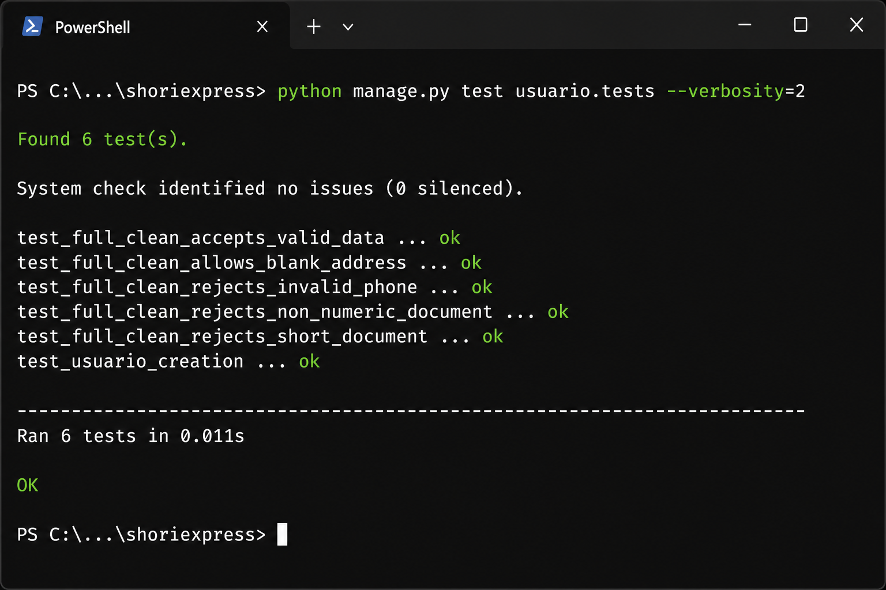

# ShoriExpress — Documento de pruebas unitarias

**Proyecto:** Sistema de gestión para restaurante de chorizos  
**Framework:** Django 4.2  
**Comando para ejecutar todas las pruebas:**

```bash
cd shoriexpress
python manage.py test
```

**Resultado verificado:** 49 pruebas — **OK** (todas pasan con dependencias instaladas desde `requirements.txt`).

---

## Índice de módulos y archivos de prueba

| # | Módulo Django | Archivo de prueba | Clases de prueba | Cantidad de tests |
|---|---------------|-------------------|------------------|-------------------|
| 1 | `usuario` | `usuario/tests.py` | `UsuarioModelTest` | 6 |
| 2 | `rol` | `rol/tests.py` | `RolModelTest` | 3 |
| 3 | `producto` | `producto/tests.py` | `ProductoAvailabilityTest` | 7 |
| 4 | `pedido` | `pedido/tests.py` | `PedidoModelTest` | 2 |
| 5 | `pedido` | `pedido/test_flujo_compra.py` | `BonosFidelidadTest`, `FinalizarCompraTest` | 7 |
| 6 | `detalle_pedido` | `detalle_pedido/tests.py` | `DetallePedidoBusinessLogicTest` | 4 |
| 7 | `inventario` | `inventario/tests.py` | `InventarioModelTest` | 1 |
| 8 | `movimiento_inventario` | `movimiento_inventario/tests.py` | `MovimientoInventarioModelTest` | 1 |
| 9 | `receta` | `receta/tests.py` | `RecetaModelTest` | 1 |
| 10 | `recibo` | `recibo/tests.py` | `ReciboModelTest` | 2 |
| 11 | `metodo_pago` | `metodo_pago/tests.py` | `MetodoPagoModelTest` | 2 |
| 12 | `dashboard` | `dashboard/tests.py` | `ConfiguracionSistemaHorariosTestCase` | 4 |
| 13 | `cuentas` | `cuentas/tests.py` | `CarritoTemplateTest` | 6 |
| 14 | `cuentas` | `cuentas/test_delete_utils.py` | `EliminarConMensajeTest` | 2 |
| 15 | `cuentas` | `cuentas/test_seed_demo.py` | `SeedDemoCommandTest` | 1 |
| | | **Total** | **15 archivos** | **49** |

---

## Evidencia: ejecución de `usuario/tests.py`

### Comando

```bash
python manage.py test usuario.tests --verbosity=2
```

### Captura de pantalla (terminal)



### Salida textual

Ver archivo adjunto: [`evidencia_usuario_tests.txt`](evidencia_usuario_tests.txt)

**Pruebas ejecutadas:**

| Test | Qué valida |
|------|------------|
| `test_usuario_creation` | Creación correcta del usuario y relación con el rol |
| `test_full_clean_accepts_valid_data` | Datos válidos pasan validación del modelo |
| `test_full_clean_rejects_short_document` | Documento con menos de 5 dígitos es rechazado |
| `test_full_clean_rejects_invalid_phone` | Teléfono inválido es rechazado |
| `test_full_clean_rejects_non_numeric_document` | Documento no numérico es rechazado |
| `test_full_clean_allows_blank_address` | Dirección vacía es permitida |

---

## 1. Módulo `usuario` — `usuario/tests.py`

```python
from django.core.exceptions import ValidationError
from django.test import TestCase

from rol.models import Rol
from usuario.models import Usuario


class UsuarioModelTest(TestCase):
    @classmethod
    def setUpTestData(cls):
        cls.rol = Rol.objects.create(nombre_rol='Cliente')
        cls.usuario = Usuario.objects.create(
            tipo_documento='CC',
            documento='12345678',
            primer_nombre='Juan',
            apellido='Pérez',
            correo='juan@example.com',
            telefono='3001234567',
            direccion='Calle 123',
            nombre_usuario='juanp',
            contrasena='password123',
            rol=cls.rol,
        )

    def test_usuario_creation(self):
        self.assertEqual(self.usuario.primer_nombre, 'Juan')
        self.assertEqual(self.usuario.rol.nombre_rol, 'Cliente')

    def test_full_clean_accepts_valid_data(self):
        self.usuario.full_clean()

    def test_full_clean_rejects_short_document(self):
        self.usuario.documento = '12'

        with self.assertRaises(ValidationError):
            self.usuario.full_clean()

    def test_full_clean_rejects_invalid_phone(self):
        self.usuario.telefono = '123'

        with self.assertRaises(ValidationError):
            self.usuario.full_clean()

    def test_full_clean_rejects_non_numeric_document(self):
        self.usuario.documento = 'ABC123'

        with self.assertRaises(ValidationError):
            self.usuario.full_clean()

    def test_full_clean_allows_blank_address(self):
        self.usuario.direccion = ''

        self.usuario.full_clean()
```

---

## 2. Módulo `rol` — `rol/tests.py`

```python
from django.test import TestCase
from django.urls import reverse

from rol.models import Rol
from usuario.models import Usuario


class RolModelTest(TestCase):
    @classmethod
    def setUpTestData(cls):
        cls.rol = Rol.objects.create(nombre_rol='Administrador')
        cls.admin_user = Usuario.objects.create(
            tipo_documento='CC',
            documento='1234567890',
            primer_nombre='Admin',
            apellido='Sistema',
            correo='admin@example.com',
            telefono='3001234567',
            direccion='Calle 1',
            nombre_usuario='adminrol',
            contrasena='secret',
            rol=cls.rol,
        )

    def test_rol_creation_and_str(self):
        self.assertEqual(self.rol.nombre_rol, 'Administrador')
        self.assertEqual(str(self.rol), 'Administrador')

    def test_crear_rol_rechaza_nombres_mayores_a_30_caracteres(self):
        session = self.client.session
        session['usuario_id'] = self.admin_user.pk
        session['usuario_rol'] = 'Administrador'
        session.save()

        response = self.client.post(
            reverse('crear_rol'),
            {'nombre_rol': 'A' * 31},
            follow=True,
        )

        self.assertEqual(response.status_code, 200)
        self.assertContains(response, '30 caracteres')

    def test_editar_rol_rechaza_nombres_mayores_a_30_caracteres(self):
        session = self.client.session
        session['usuario_id'] = self.admin_user.pk
        session['usuario_rol'] = 'Administrador'
        session.save()

        rol = Rol.objects.create(nombre_rol='Cajero')

        response = self.client.post(
            reverse('editar_rol', args=[rol.id]),
            {'nombre_rol': 'B' * 31},
            follow=True,
        )

        self.assertEqual(response.status_code, 200)
        self.assertContains(response, '30 caracteres')
```

---

## 3. Módulo `producto` — `producto/tests.py`

Prueba disponibilidad según inventario/recetas, toggle de habilitado y operaciones del carrito (agregar, restar, eliminar, cantidad manual).

**Tests:** `test_check_ingredient_stock_returns_true_for_sufficient_supply`, `test_update_availability_based_on_stock_disables_product_when_ingredients_are_insufficient`, `test_is_available_for_sale_is_false_when_stock_is_insufficient`, `test_toggle_habilitado_altera_el_estado_de_visibilidad`, `test_agregar_producto_via_get_agrega_al_carrito`, `test_restar_y_eliminar_carrito_requieren_post`, `test_set_cantidad_carrito_via_get`.

*(Archivo completo: 160 líneas — ver repositorio `producto/tests.py`)*

---

## 4. Módulo `pedido` — `pedido/tests.py`

```python
from decimal import Decimal

from django.test import TestCase

from pedido.models import Pedido
from rol.models import Rol
from usuario.models import Usuario


class PedidoModelTest(TestCase):
    @classmethod
    def setUpTestData(cls):
        cls.rol = Rol.objects.create(nombre_rol='Cliente')
        cls.usuario = Usuario.objects.create(
            tipo_documento='CC',
            documento='98765432',
            primer_nombre='Ana',
            apellido='Lopez',
            correo='ana@example.com',
            telefono='3007654321',
            direccion='Carrera 5',
            nombre_usuario='analo',
            contrasena='secret',
            rol=cls.rol,
        )
        cls.pedido = Pedido.objects.create(
            usuario=cls.usuario,
            tipo_pedido='domicilio',
            direccion_pedido='Calle 9',
            estado_pedido='pendiente',
            total_pedido=Decimal('25.50'),
        )

    def test_pedido_defaults_and_str(self):
        self.assertEqual(self.pedido.estado_pedido, 'pendiente')
        self.assertEqual(self.pedido.tipo_pedido, 'domicilio')
        self.assertEqual(str(self.pedido), f'Pedido #{self.pedido.id} - Ana (pendiente)')

    def test_pedido_guarda_instrucciones(self):
        pedido = Pedido.objects.create(
            usuario=self.usuario,
            tipo_pedido='domicilio',
            direccion_pedido='Calle 9',
            estado_pedido='pendiente',
            total_pedido=Decimal('25.50'),
            instrucciones_pedido='Sin cebolla y con salsa aparte',
        )

        self.assertEqual(pedido.instrucciones_pedido, 'Sin cebolla y con salsa aparte')
```

---

## 5. Módulo `pedido` — `pedido/test_flujo_compra.py`

Pruebas de integración del flujo de compra y bonos de fidelidad.

| Clase | Tests |
|-------|-------|
| `BonosFidelidadTest` | No otorga bono si no está entregado; no otorga si total < umbral; otorga al entregar; no duplica bono; cambiar estado a entregado acredita bono |
| `FinalizarCompraTest` | Finalizar compra no suma bono al pagar; redime bonos con descuento |

*(Archivo completo: 236 líneas — ver repositorio `pedido/test_flujo_compra.py`)*

---

## 6. Módulo `detalle_pedido` — `detalle_pedido/tests.py`

```python
# Clase: DetallePedidoBusinessLogicTest
# Tests:
# - test_subtotal_uses_quantity_and_unit_price
# - test_subtotal_con_iva_uses_configured_tax
# - test_str_representation_contains_product_and_order
# - test_lista_detalles_no_falla_con_fechas_invalidas
```

*(Archivo completo: 80 líneas — ver repositorio `detalle_pedido/tests.py`)*

---

## 7. Módulo `inventario` — `inventario/tests.py`

```python
from decimal import Decimal

from django.test import TestCase

from inventario.models import Inventario


class InventarioModelTest(TestCase):
    @classmethod
    def setUpTestData(cls):
        cls.insumo = Inventario.objects.create(
            nombre_insumo='Tomate',
            categoria_insumo='Vegetal',
            unidad_medida='KG',
            stock_actual=Decimal('10.50'),
            stock_minimo=Decimal('2.00'),
            stock_maximo=Decimal('20.00'),
            precio_compra_referencia=Decimal('5000.00'),
            iva_porcentaje=Decimal('19.00'),
            estado_insumo='disponible',
        )

    def test_inventario_str_uses_name_and_stock(self):
        expected = 'Tomate (10.50 Kilogramos)'
        self.assertEqual(str(self.insumo), expected)
```

---

## 8. Módulo `movimiento_inventario` — `movimiento_inventario/tests.py`

```python
# Clase: MovimientoInventarioModelTest
# Test: test_movimiento_str_uses_display_and_lote
# Valida representación textual del movimiento con tipo, insumo y lote.
```

---

## 9. Módulo `receta` — `receta/tests.py`

```python
# Clase: RecetaModelTest
# Test: test_receta_str_contains_product_and_required_quantity
# Valida que __str__ muestre producto, cantidad e insumo.
```

---

## 10. Módulo `recibo` — `recibo/tests.py`

```python
# Clase: ReciboModelTest
# Tests:
# - test_recibo_str_contains_order
# - test_numero_recibo_uses_internal_id
```

---

## 11. Módulo `metodo_pago` — `metodo_pago/tests.py`

```python
# Clase: MetodoPagoModelTest
# Tests:
# - test_metodo_pago_str_and_status
# - test_eliminar_metodo_referenciado_muestra_warning
```

---

## 12. Módulo `dashboard` — `dashboard/tests.py`

```python
# Clase: ConfiguracionSistemaHorariosTestCase
# Tests:
# - test_horario_dentro_del_dia
# - test_horario_overnight (horario que cruza medianoche)
# - test_horario_apertura_cierre_iguales_es_invalido
# - test_get_config_uses_existing_record
```

---

## 13. Módulo `cuentas` — `cuentas/tests.py`

```python
# Clase: CarritoTemplateTest
# Tests:
# - test_carrito_muestra_telefono_del_usuario
# - test_logout_via_get_cierra_sesion
# - test_login_acepta_nombres_de_usuario_con_distinta_mayuscula
# - test_credencial_vencida_no_falla_con_valores_invalidos
# - test_context_processor_expone_usuario_logueado_para_el_menu
# - test_menu_publico_muestra_productos_en_menu_aunque_no_esten_habilitados
```

---

## 14. Módulo `cuentas` — `cuentas/test_delete_utils.py`

```python
# Clase: EliminarConMensajeTest
# Tests:
# - test_eliminar_con_mensaje_exito
# - test_eliminar_con_mensaje_protegido (ProtectedError → mensaje al usuario)
```

---

## 15. Módulo `cuentas` — `cuentas/test_seed_demo.py`

```python
from io import StringIO

from django.core.management import call_command
from django.test import TestCase

from metodo_pago.models import MetodoPago
from producto.models import Producto
from rol.models import Rol
from usuario.models import Usuario


class SeedDemoCommandTest(TestCase):
    def test_seed_demo_es_idempotente_y_crea_datos_base(self):
        out = StringIO()
        call_command('seed_demo', stdout=out)
        call_command('seed_demo', stdout=out)

        self.assertGreaterEqual(Rol.objects.count(), 4)
        self.assertGreaterEqual(Usuario.objects.count(), 1)
        self.assertGreaterEqual(Producto.objects.count(), 1)
        self.assertTrue(MetodoPago.objects.filter(nombre_metodo='Efectivo').exists())
        self.assertIn('Demo lista', out.getvalue())
```

---

## Cómo reproducir en tu máquina (para sustentación en vivo)

```bash
# Todas las pruebas
python manage.py test

# Solo un módulo
python manage.py test usuario.tests
python manage.py test producto.tests
python manage.py test pedido.test_flujo_compra

# Con detalle
python manage.py test usuario.tests --verbosity=2
```

**Requisito:** tener instaladas las dependencias del proyecto (`pip install -r requirements.txt`), incluyendo `whitenoise`.

---

## Notas para la sustentación

- Las pruebas usan una **base de datos en memoria** creada y destruida automáticamente por Django (`Creating test database...` / `Destroying test database...`).
- Cubren **modelos**, **vistas**, **validaciones de negocio**, **carrito**, **bonos**, **borrados seguros** y **comando de datos demo**.
- El módulo `usuario` valida reglas de integridad de datos (documento, teléfono, dirección) antes de persistir usuarios en el sistema.

---

*Documento generado para ShoriExpress — Pruebas unitarias Django.*
